<!---------------------------------------------------------------------------->
<!--  HERO BANNER                                                            -->
<!---------------------------------------------------------------------------->

<!---------------------------------------------------------------------------->
<!--  TYPING + SOCIALS                                                       -->
<!---------------------------------------------------------------------------->

 

&ensp;&ensp;&ensp;

 

&ensp;&ensp;

<!---------------------------------------------------------------------------->
<!--  ABOUT ME + STATS                                                       -->
<!---------------------------------------------------------------------------->

<b>Full Stack Developer focused on building scalable and reliable products.</b>

  

<table width="100%" border="0" cellpadding="6">
<tr>
<td width="50%" valign="top">

  

</td>
<td width="50%" valign="top">

</td>
</tr>
</table>

<table width="100%" border="0" cellpadding="6">
<tr>
<td width="50%">

</td>
<td width="50%">

</td>
</tr>
<tr>
<td colspan="3">

</td>
</tr>
</table>

 

<!--  SNAKE ANIMATION  (add GitHub Action to generate this — see setup note below) -->

  
<picture>
 
</picture>
  

<picture>
  <source media="(prefers-color-scheme: dark)" srcset="https://raw.githubusercontent.com/phero20/phero20/output/pacman-contribution-graph-dark.svg">
  <source media="(prefers-color-scheme: light)" srcset="https://raw.githubusercontent.com/phero20/phero20/output/pacman-contribution-graph.svg">
  
</picture>

  

<!--  -->

<!---------------------------------------------------------------------------->
<!--  TECH ARSENAL                                                           -->
<!---------------------------------------------------------------------------->

<!-- ════════════════════  LANGUAGES  ════════════════════ -->
 

 

<table><tr>
  <td align="center" width="110"> <b>Java</b></td>
  <td align="center" width="110"> <b>Go</b></td>
  <td align="center" width="110"> <b>Rust</b></td>
    <td align="center" width="110"> <b>C#</b></td>
</tr></table>

 

<table><tr>
    <td align="center" width="110"> <b>C</b></td>
  <td align="center" width="120"> <b>Python</b></td>
    <td align="center" width="110"> <b>TypeScript</b></td>
  <td align="center" width="120"> <b>JavaScript</b></td>

</tr></table>

 

 

<!-- ════════════════════  FRONTEND  ════════════════════ -->

  

<table><tr>

  <td align="center" width="110"> <b>React</b></td>
  <td align="center" width="110"> <b>Next.js</b></td>
  <td align="center" width="110"> <b>Tailwind CSS</b></td>
  <td align="center" width="110"> <b>Vite</b></td>
  <td align="center" width="110"> <b>HTML5</b></td>
  <td align="center" width="110"> <b>CSS3</b></td>
</tr></table>

  

<!-- ════════════════════  BACKEND  ════════════════════ -->

  

<table><tr>
  <td align="center" width="110"> <b>Node.js</b></td>
  <td align="center" width="110"> <b>Express</b></td>
  <td align="center" width="110"> <b>Hono</b></td>
  <td align="center" width="110"> <b>Elysia</b></td>
  <td align="center" width="110"> <b>Bun</b></td>
  <td align="center" width="110"> &nbsp;&nbsp;&nbsp; <b>Go Fiber</b></td>
</tr></table>

  

<!-- ════════════════════  DATABASES  ════════════════════ -->

 

<table align="center">
<tr>
  <td align="center" width="110"> <b>PostgreSQL</b></td>
  <td align="center" width="110"> <b>MySQL</b></td>
  <td align="center" width="110"> <b>MongoDB</b></td>
  <td align="center" width="110"> <b>Redis</b></td>
    <td align="center" width="110"> <b>Drizzle</b></td>
     
</tr></table>
 
<table>
<tr>
   <td align="center" width="110"> <b>Prisma</b></td>
  <td align="center" width="110"> <b>Supabase</b></td>
  <td align="center" width="110"> <b>ConvexDB</b></td>
 <td align="center" width="110"> <b>Firebase</b></td>
  <td align="center" width="110"> <b>NeonDB</b></td>
</tr>
</table>

  

<!-- ════════════════════  CLOUD  ════════════════════ -->

 

<table>
<tr>
  <td align="center" width="110"> <b>AWS</b></td>
  <td align="center" width="110"> <b>Google Cloud</b></td>
  <td align="center" width="110"> <b>Cloudflare</b></td>
  <td align="center" width="110"> <b>Fly.io</b></td>
</tr>
</table>
 
<table>
<tr>
  <td align="center" width="110"> <b>Render</b></td>
  <td align="center" width="110"> <b>Vercel</b></td>
  <td align="center" width="110"> <b>Netlify</b></td>
</tr>
</table>

  

<!-- ════════════════════  DEVOPS  ════════════════════ -->

 

<table><tr>
  <td align="center" width="110"> <b>Docker</b></td>
  <td align="center" width="110"> <b>Nginx</b></td>
  <td align="center" width="110"> <b>GH Actions</b></td>
  <td align="center" width="110"> <b>Linux</b></td>
  <td align="center" width="110"> <b>Git</b></td>
</tr></table>

 

  

<!---------------------------------------------------------------------------->
<!--  LEETCODE                                                               -->
<!---------------------------------------------------------------------------->

 

 

  

